# ERD Cơ Sở Dữ Liệu Và Đối Chiếu API

Tài liệu mô tả lược đồ dữ liệu giai đoạn 1 ở mức thiết kế logic cho PostgreSQL, đã tối ưu cho **đúng nghiệp vụ, bảo mật, hiệu năng và chịu tải**. Đọc kèm:

- `15-architecture-and-tech-stack.md`: quy ước ID/thời gian/tiền/outbox/idempotency (áp dụng cho MỌI bảng dưới đây).
- `09-notification-and-state-flows.md`: định nghĩa state machine.
- `12-non-functional-requirements.md`: chiến lược index/cache/scale.
- `13-security-and-threat-model.md` và `14-data-privacy-and-compliance.md`: phân loại dữ liệu nhạy cảm.

## 0. Quy ước áp dụng toàn bộ schema

- **PK**: ULID (`char(26)`). FK cùng kiểu. Không dùng auto-increment lộ số lượng.
- **Thời gian**: `timestamptz`, lưu UTC. Mọi bảng có `created_at`; bảng sửa được có `updated_at`.
- **Tiền**: `bigint` theo đồng VND, kèm `currency`. Không float.
- **Xóa mềm**: bảng nghiệp vụ có `deleted_at timestamptz null`. Bảng tài chính/audit là append-only.
- **Enum**: `text` + CHECK constraint (liệt kê ở từng bảng).
- **Tương tranh**: bảng có state machine có `version int not null default 0`.
- **PII**: các trường đánh dấu 🔒 là dữ liệu cá nhân — áp dụng chính sách ở `14-data-privacy-and-compliance.md` (hạn chế log, cân nhắc mã hóa cột, retention).

## 1. Thay đổi chính so với bản trước (vì sao)

1. **Chuẩn hóa dữ liệu tìm kiếm**: `subjects/grade_levels/teaching_modes/offline_areas` tách thành bảng con (hoặc mảng + GIN) thay vì chuỗi CSV → index và lọc được ở tải cao.
2. **Denormalize điểm đánh giá**: thêm `rating_avg`, `rating_count` vào `tutor_profiles` → không phải AGG `reviews` mỗi lần search.
3. **Thêm `leads`**: chứa yêu cầu dạy thử của khách chưa có tài khoản (guest) → phễu không gãy.
4. **Thêm bảng tài chính/vận hành thiếu**: `refunds`, `idempotency_keys`, `webhook_events`, `outbox_events`, `audit_logs`, `legal_documents`, `tutor_payout_accounts`, `review_edits`, `media_assets`.
5. **Ràng buộc duy nhất & tương tranh** rõ ràng (chống double-accept, review trùng, race webhook).
6. **`subscriptions` gắn scope theo học sinh** cho gói `parent_tracking` (theo quyết định sản phẩm: tính theo mỗi con).
7. **`profile_unlocks` mặc định vĩnh viễn** (`expires_at = null`) theo quyết định sản phẩm.
8. **Thêm `auth_accounts` và cho phép `users.phone` nullable**: email + password (bảng `user_credentials`) và Google OAuth server-side là đường đăng ký/đăng nhập chính; SĐT chỉ để liên hệ, không đăng nhập (đã bỏ OTP-SMS).
9. **Thêm cấu hình vận hành cho `tutor-admin`**: `platform_payment_accounts`, `product_pricing`, `paid_feature_overrides` để chủ dự án cấu hình VietQR nền tảng, giá sản phẩm và quyền paid feature theo user.
10. **Tách credential admin và phiên refresh**: `admin_credentials` quan hệ 1-1 với `users`, lưu scrypt hash/counter/lock/password-change time; `refresh_tokens` chỉ lưu token hash + rotation chain/revocation trong PostgreSQL. Parent/tutor dùng email + password (bảng `user_credentials`) hoặc Google OAuth server-side.

## 2. Sơ đồ ERD tổng thể

```mermaid
erDiagram
    USERS {
        char id PK
        string phone "🔒 nullable, unique khi có"
        string email "🔒 nullable, unique khi có"
        string roles "mảng: parent|tutor|admin"
        string status "pending_consent|active|suspended|deleted"
        datetime created_at
        datetime updated_at
        datetime deleted_at
    }

    AUTH_ACCOUNTS {
        char id PK
        char user_id FK
        string provider "google|facebook"
        string provider_user_id
        string email "🔒 nullable"
        boolean email_verified
        string display_name
        string avatar_url "avatar từ OAuth provider, khác với tutor avatar media"
        datetime created_at
        datetime updated_at
    }

    ADMIN_CREDENTIALS {
        char user_id PK,FK
        string password_hash "scrypt hash"
        int failed_attempts
        datetime locked_until
        datetime password_changed_at
        datetime created_at
        datetime updated_at
    }

    REFRESH_TOKENS {
        char id PK
        char user_id FK
        string token_hash "unique"
        datetime expires_at
        datetime revoked_at
        char rotated_to_id "token con khi rotate"
        string created_ip "nullable"
        datetime created_at
    }

    LEGAL_DOCUMENTS {
        char id PK
        string doc_type "terms|privacy"
        string version "vd 2026-01"
        string locale "vi-VN"
        string title
        string content_url "bản đầy đủ"
        string checksum "hash nội dung"
        boolean is_active
        datetime published_at
    }

    LEGAL_CONSENTS {
        char id PK
        char user_id FK
        string role_at_acceptance
        char terms_document_id FK
        char privacy_document_id FK
        datetime accepted_at
        boolean scroll_reached_bottom
        string consent_method
        string ip_address "🔒"
        string user_agent "🔒"
    }

    PARENT_PROFILES {
        char id PK
        char user_id FK
        string display_name
        string status
        datetime created_at
        datetime updated_at
        datetime deleted_at
    }

    STUDENTS {
        char id PK
        char parent_profile_id FK
        string name "🔒 dữ liệu trẻ vị thành niên"
        string grade
        string learning_goals
        string status
        datetime created_at
        datetime updated_at
        datetime deleted_at
    }

    TUTOR_PROFILES {
        char id PK
        char user_id FK
        string display_name
        string avatar_media_id FK
        string intro_video_media_id FK
        string bio
        string region "enum vùng"
        string voice_accent
        string gender
        string education_level
        string school_name
        int student_year
        float exam_score "tự khai báo"
        float gpa "tự khai báo"
        bigint expected_fee_min
        bigint expected_fee_max
        string status "draft|publishable|published|hidden|suspended"
        string moderation_status "pending|approved|rejected"
        float rating_avg "denormalized"
        int rating_count "denormalized"
        int version
        datetime published_at
        datetime created_at
        datetime updated_at
        datetime deleted_at
    }

    TUTOR_SUBJECTS {
        char id PK
        char tutor_profile_id FK
        string subject_code "chuẩn hóa: math|physics|..."
    }

    TUTOR_GRADE_LEVELS {
        char id PK
        char tutor_profile_id FK
        int grade_level "1..12"
    }

    TUTOR_TEACHING_MODES {
        char id PK
        char tutor_profile_id FK
        string mode "online|offline"
    }

    TUTOR_OFFLINE_AREAS {
        char id PK
        char tutor_profile_id FK
        string province_code
        string district_code
    }

    MEDIA_ASSETS {
        char id PK
        char owner_user_id FK
        string kind "avatar|intro_video|other"
        string storage_key
        string content_type
        bigint size_bytes
        string moderation_status "pending|approved|rejected"
        string scan_status "pending|clean|infected"
        datetime created_at
    }

    TUTOR_AVAILABILITIES {
        char id PK
        char tutor_profile_id FK
        int day_of_week "0..6"
        time start_time
        time end_time
        string type "busy|available"
        string note
    }

    TUTOR_PAYOUT_ACCOUNTS {
        char id PK
        char tutor_profile_id FK
        string bank_code
        string account_number "🔒"
        string account_holder "🔒"
        boolean is_default
        datetime created_at
        datetime updated_at
    }

    PAYMENTS {
        char id PK
        char payer_user_id FK
        string product_type "single_unlock|parent_vip|parent_tracking|tutor_qr"
        char target_ref_id "id đối tượng đích: tutor_profile_id/student_id..."
        bigint amount
        string currency
        string provider
        string provider_reference "unique khi có"
        string status "pending|paid|failed|cancelled|refunded"
        string idempotency_key
        int version
        datetime created_at
        datetime paid_at
    }

    REFUNDS {
        char id PK
        char payment_id FK
        bigint amount
        string reason
        string status "requested|processing|done|rejected"
        char actor_user_id FK "admin"
        datetime created_at
        datetime processed_at
    }

    WEBHOOK_EVENTS {
        char id PK
        string provider
        string provider_reference
        string signature_verified "true|false"
        string raw_payload_hash
        string process_status "received|processed|duplicate|invalid"
        datetime received_at
        datetime processed_at
    }

    IDEMPOTENCY_KEYS {
        char id PK
        string scope "endpoint"
        string key
        char user_id FK
        string response_hash
        datetime created_at
        datetime expires_at
    }

    PRODUCT_PRICING {
        char id PK
        string product_type "single_unlock|parent_vip|parent_tracking|tutor_qr"
        bigint amount
        string currency
        int period_days "null cho single_unlock"
        boolean is_enabled
        datetime created_at
        datetime updated_at
    }

    PLATFORM_PAYMENT_ACCOUNTS {
        char id PK
        string bank_code
        string account_number "🔒 PII"
        string account_holder "🔒 PII"
        boolean is_active
        datetime created_at
        datetime updated_at
    }

    PAID_FEATURE_OVERRIDES {
        char id PK
        char user_id FK
        string feature "single_unlock|parent_vip|parent_tracking|tutor_qr"
        boolean enabled
        string reason
        datetime expires_at
        datetime created_at
        datetime updated_at
    }

    PROFILE_UNLOCKS {
        char id PK
        char parent_profile_id FK
        char tutor_profile_id FK
        char payment_id FK "null nếu do VIP"
        string source "single_unlock|vip_subscription"
        datetime starts_at
        datetime expires_at "null = vĩnh viễn"
        string status "active|expired|revoked"
        datetime created_at
    }

    SUBSCRIPTIONS {
        char id PK
        char user_id FK
        string type "parent_vip_unlock|parent_tracking|tutor_qr"
        char scope_ref_id "student_id cho parent_tracking; null cho vip/qr"
        char payment_id FK
        string status "pending_payment|active|past_due|expired|cancelled|refunded"
        boolean auto_renew
        datetime starts_at
        datetime current_period_end
        datetime cancelled_at
        int version
        datetime created_at
        datetime updated_at
    }

    LEADS {
        char id PK
        string contact_name "🔒"
        string contact_phone "🔒"
        string contact_email "🔒 nullable"
        char converted_parent_profile_id FK "null đến khi kích hoạt"
        string status "new|converted|expired"
        datetime created_at
        datetime expires_at
    }

    TRIAL_REQUESTS {
        char id PK
        char parent_profile_id FK "null nếu là guest"
        char lead_id FK "null nếu đã có tài khoản"
        char student_id FK "null nếu guest chưa tạo student"
        char tutor_profile_id FK
        string subject
        string grade
        string learning_goal
        string teaching_mode
        string preferred_schedule
        string message
        string decline_reason "nullable; không ghi đè message"
        string contact_snapshot "🔒 liên hệ tối thiểu tại thời điểm gửi"
        string status "pending|accepted|declined|expired|cancelled"
        int version
        datetime created_at
        datetime responded_at
        datetime expires_at
    }

    CLASS_CONTRACTS {
        char id PK
        char trial_request_id FK
        char parent_profile_id FK
        char student_id FK
        char tutor_profile_id FK
        string subject
        string status "trial_accepted|active|paused|completed_pending_review|completed|cancelled"
        int version
        datetime started_at
        datetime ended_at
        datetime created_at
        datetime updated_at
    }

    LESSON_LOGS {
        char id PK
        char class_contract_id FK
        char tutor_profile_id FK
        datetime lesson_at
        string subject
        string content
        string homework
        string absorption_level "good|normal|needs_review"
        string tutor_note
        datetime created_at
        datetime updated_at
        datetime deleted_at
    }

    REVIEWS {
        char id PK
        char class_contract_id FK "unique"
        char parent_profile_id FK
        char tutor_profile_id FK
        int rating "1..5"
        string comment
        string status "pending_moderation|published|hidden|disputed"
        datetime editable_until
        datetime created_at
        datetime updated_at
    }

    REVIEW_EDITS {
        char id PK
        char review_id FK
        int old_rating
        string old_comment
        char edited_by FK
        datetime created_at
    }

    TUTOR_PAYMENT_QR_RECORDS {
        char id PK
        char tutor_profile_id FK
        char class_contract_id FK
        char payout_account_id FK
        bigint amount
        string description
        string qr_url
        string payment_link
        string collection_status "created|sent|marked_collected|cancelled"
        datetime marked_collected_at
        datetime created_at
    }

    NOTIFICATIONS {
        char id PK
        char recipient_user_id FK
        string channel "in_app|sms|email|push"
        string type
        string payload
        string status "queued|sent|failed|read"
        int retry_count
        datetime created_at
        datetime read_at
    }

    OUTBOX_EVENTS {
        char id PK
        string aggregate_type
        char aggregate_id
        string event_type
        string payload
        string status "pending|processing|done|failed"
        int retry_count
        datetime available_at
        datetime created_at
        datetime processed_at
    }

    AUDIT_LOGS {
        char id PK
        char actor_user_id FK
        string actor_role
        string action
        string entity_type
        char entity_id
        string before_hash
        string after_hash
        string ip_address "🔒"
        datetime created_at
    }

    USERS ||--o{ LEGAL_CONSENTS : dong_y
    USERS ||--o{ AUTH_ACCOUNTS : dang_nhap_bang
    USERS ||--o| ADMIN_CREDENTIALS : credential_admin
    USERS ||--o{ REFRESH_TOKENS : co_phien_refresh
    USERS ||--o| PARENT_PROFILES : co_the_la
    USERS ||--o| TUTOR_PROFILES : co_the_la
    USERS ||--o{ PAYMENTS : tao
    USERS ||--o{ SUBSCRIPTIONS : so_huu
    USERS ||--o{ NOTIFICATIONS : nhan
    USERS ||--o{ MEDIA_ASSETS : so_huu
    USERS ||--o{ PAID_FEATURE_OVERRIDES : override_paid_feature
    LEGAL_DOCUMENTS ||--o{ LEGAL_CONSENTS : duoc_dong_y

    PARENT_PROFILES ||--o{ STUDENTS : co
    PARENT_PROFILES ||--o{ PROFILE_UNLOCKS : mua
    PARENT_PROFILES ||--o{ TRIAL_REQUESTS : gui
    PARENT_PROFILES ||--o{ CLASS_CONTRACTS : tham_gia
    PARENT_PROFILES ||--o{ REVIEWS : viet

    LEADS ||--o| PARENT_PROFILES : chuyen_doi
    LEADS ||--o{ TRIAL_REQUESTS : gui_guest

    TUTOR_PROFILES ||--o{ TUTOR_SUBJECTS : day_mon
    TUTOR_PROFILES ||--o{ TUTOR_GRADE_LEVELS : day_khoi
    TUTOR_PROFILES ||--o{ TUTOR_TEACHING_MODES : hinh_thuc
    TUTOR_PROFILES ||--o{ TUTOR_OFFLINE_AREAS : khu_vuc
    TUTOR_PROFILES ||--o{ TUTOR_AVAILABILITIES : khai_bao
    TUTOR_PROFILES ||--o{ TUTOR_PAYOUT_ACCOUNTS : nhan_tien
    TUTOR_PROFILES ||--o{ PROFILE_UNLOCKS : duoc_mo_khoa
    TUTOR_PROFILES ||--o{ TRIAL_REQUESTS : nhan
    TUTOR_PROFILES ||--o{ CLASS_CONTRACTS : day
    TUTOR_PROFILES ||--o{ LESSON_LOGS : ghi
    TUTOR_PROFILES ||--o{ REVIEWS : duoc_danh_gia
    TUTOR_PROFILES ||--o{ TUTOR_PAYMENT_QR_RECORDS : tao_qr

    STUDENTS ||--o{ TRIAL_REQUESTS : duoc_dang_ky
    STUDENTS ||--o{ CLASS_CONTRACTS : hoc
    STUDENTS ||--o{ SUBSCRIPTIONS : duoc_theo_doi

    PAYMENTS ||--o| PROFILE_UNLOCKS : kich_hoat
    PAYMENTS ||--o| SUBSCRIPTIONS : kich_hoat
    PAYMENTS ||--o{ REFUNDS : co_hoan_tien

    TRIAL_REQUESTS ||--o| CLASS_CONTRACTS : tao_lop
    CLASS_CONTRACTS ||--o{ LESSON_LOGS : co_so_dau_bai
    CLASS_CONTRACTS ||--o| REVIEWS : co_danh_gia
    CLASS_CONTRACTS ||--o{ TUTOR_PAYMENT_QR_RECORDS : co_qr
    REVIEWS ||--o{ REVIEW_EDITS : co_lich_su
    TUTOR_PAYOUT_ACCOUNTS ||--o{ TUTOR_PAYMENT_QR_RECORDS : dung_cho
```

## 3. Ràng buộc & bất biến quan trọng (business + toàn vẹn dữ liệu)

- `users.phone` **UNIQUE**; `users.email` unique khi khác null.
- `reviews.class_contract_id` **UNIQUE** → mỗi lớp tối đa 1 đánh giá chính.
- `profile_unlocks (parent_profile_id, tutor_profile_id)` **UNIQUE** → mỗi cặp parent-gia sư có một dòng entitlement; service reactivate/revoke dòng này để chống mở khóa trùng.
- `subscriptions`: UNIQUE partial `(user_id, type)` khi `status IN (pending_payment, active, past_due)` cho `parent_vip_unlock`/`tutor_qr`; với `parent_tracking` UNIQUE partial `(user_id, scope_ref_id, type)` → mỗi học sinh chỉ 1 gói tracking đang chạy.
- `payments.provider_reference` **UNIQUE** khi khác null; `payments.idempotency_key` UNIQUE theo user.
- `webhook_events (provider, provider_reference)` **UNIQUE** → chống xử lý webhook trùng.
- `activation_tokens.token_hash` **UNIQUE**; token kích hoạt lead lưu dạng hash, có `expires_at` và `consumed_at` để chống replay.
- `class_contracts`: chuyển trạng thái bằng `UPDATE ... WHERE id=:id AND version=:v` (optimistic lock) → chống double-accept.
- CHECK: `payments.amount > 0`, `reviews.rating BETWEEN 1 AND 5`, `expected_fee_min <= expected_fee_max`, `tutor_grade_levels.grade_level BETWEEN 1 AND 12`.
- `trial_requests`: đúng một trong `parent_profile_id` hoặc `lead_id` khác null (CHECK).
- FK có `ON DELETE RESTRICT` cho dữ liệu tài chính; xóa người dùng dùng soft delete + ẩn danh (xem `14-...`).

## 4. Chỉ mục (index) — phục vụ hiệu năng & chịu tải

Chi tiết chiến lược ở `12-non-functional-requirements.md`. Tối thiểu:

- **Search chợ gia sư** (hot-path):
  - `tutor_profiles (status, published_at)` partial `WHERE status='published' AND deleted_at IS NULL`.
  - Index trên các bảng chuẩn hóa: `tutor_subjects(subject_code, tutor_profile_id)`, `tutor_grade_levels(grade_level, tutor_profile_id)`, `tutor_teaching_modes(mode, tutor_profile_id)`, `tutor_offline_areas(province_code, district_code, tutor_profile_id)`.
  - `tutor_profiles (region, expected_fee_min, expected_fee_max)`, index `rating_avg`, `student_year`, `education_level`.
  - `school_name`: hiện lọc substring bằng `ILIKE` (chưa có index full-text). Nâng cấp theo ngưỡng: GIN trigram (`pg_trgm`) cho substring hoặc `tsvector` cho full-text, khai bằng raw SQL migration; quá ngưỡng ở `15` → Meilisearch qua outbox. `bio` là nội dung sau paywall nên **không** đưa vào chỉ mục tìm kiếm công khai.
- Mọi cột FK đều có index.
- `profile_unlocks (parent_profile_id, tutor_profile_id, status)`.
- `subscriptions (user_id, type, status, current_period_end)`, `subscriptions (scope_ref_id, type, status)`.
- `class_contracts (parent_profile_id, status)`, `(tutor_profile_id, status)`.
- `lesson_logs (class_contract_id, lesson_at DESC)` — dựng timeline + keyset pagination.
- `reviews (tutor_profile_id, status)` partial `WHERE status='published'`.
- `notifications (recipient_user_id, status, created_at DESC)`.
- `outbox_events (status, available_at)` — worker quét.
- `audit_logs (entity_type, entity_id, created_at)`.
- `payments (payer_user_id, status, created_at)`.

## 5. Đối chiếu API với bảng dữ liệu

| Nhóm API | Đọc dữ liệu | Ghi dữ liệu | Quy tắc chính |
| --- | --- | --- | --- |
| Tìm kiếm gia sư công khai | `tutor_profiles` + bảng chuẩn hóa + `rating_avg` | Không ghi | Chỉ bản xem thử; **không** AGG review runtime (dùng cột denormalized); keyset pagination |
| Chi tiết gia sư công khai | `tutor_profiles`, `profile_unlocks`, `subscriptions`, `reviews`, `media_assets` | Không ghi | Mở chi tiết khi có unlock/VIP hợp lệ; video chỉ trả signed URL khi có quyền |
| Xác thực/consent | `users`, `auth_accounts`, `admin_credentials`, `refresh_tokens`, `email_tokens`, `legal_documents`, `legal_consents` | như trái | Parent/tutor dùng email + password hoặc Google OAuth server-side; admin dùng email/password scrypt + lock/rate limit; refresh hash/rotation/revocation nằm trong PostgreSQL; mọi nhánh vẫn kiểm tra status/role và consent ở server |
| Hồ sơ phụ huynh | `parent_profiles`, `students` | như trái | Chỉ sửa dữ liệu của chính mình (ownership check) |
| Hồ sơ gia sư | `tutor_profiles`, bảng chuẩn hóa, `tutor_availabilities`, `media_assets` | như trái | Chỉ sửa hồ sơ của mình; media qua signed upload + kiểm duyệt |
| Payout account | `tutor_payout_accounts` | như trái | Chỉ gia sư sở hữu; số tài khoản là PII |
| Mở khóa hồ sơ | `payments`, `profile_unlocks`, `subscriptions` | `payments`, `profile_unlocks` | Chỉ tạo unlock khi `paid`; qua webhook đã verify chữ ký; idempotent |
| Gói định kỳ | `payments`, `subscriptions` | như trái | `parent_tracking` gắn `scope_ref_id = student_id`; hết hạn khóa tính năng, giữ dữ liệu |
| Yêu cầu dạy thử | `trial_requests`, `leads`, `tutor_profiles`, `students` | `trial_requests`, `leads`, `outbox_events` | Guest ghi vào `leads`; chỉ request `pending` mới xử lý; rate limit |
| Chấp nhận yêu cầu | `trial_requests` | `trial_requests`, `class_contracts`, `outbox_events` | Optimistic lock chống double-accept; tạo/liên kết lớp |
| Danh sách lớp | `class_contracts`, `students`, `tutor_profiles` | Không ghi | Chỉ phụ huynh/gia sư thuộc lớp |
| Sổ đầu bài | `class_contracts`, `lesson_logs` | `lesson_logs`, `outbox_events` | Chỉ gia sư của lớp; sửa trong khung thời gian; soft delete |
| Dashboard phụ huynh | `class_contracts`, `lesson_logs`, `subscriptions` | Không ghi | Chi tiết chỉ mở khi có `subscriptions(parent_tracking, active, scope_ref_id=student)` |
| Đánh giá sau lớp | `class_contracts`, `reviews` | `reviews`, `review_edits`, `outbox_events` | Chỉ phụ huynh của lớp đã kết thúc; 1 review/lớp; sửa đến `editable_until`; cập nhật `rating_avg` |
| QR thanh toán gia sư | `subscriptions`, `class_contracts`, `tutor_payout_accounts`, `tutor_payment_qr_records` | `tutor_payment_qr_records` | Chỉ gia sư có gói QR active + có payout account |
| Webhook thanh toán | `payments`, `webhook_events` | `payments`, `profile_unlocks`, `subscriptions`, `webhook_events`, `outbox_events` | **Verify chữ ký + đối chiếu số tiền**; chống trùng qua `webhook_events` |
| Thông báo | `notifications`, `outbox_events` | `notifications` | Worker tiêu thụ outbox; có retry |
| Quản trị/kiểm duyệt | các bảng vận hành, `media_assets`, `reviews` | trạng thái + `audit_logs` | Mọi hành động ghi `audit_logs` |
| Tutor Admin vận hành | `users`, `payments`, `subscriptions`, `audit_logs`, `webhook_events`, `outbox_events`, `platform_payment_accounts`, `product_pricing`, `paid_feature_overrides` | `users.status`, `platform_payment_accounts`, `product_pricing`, `paid_feature_overrides`, `audit_logs` | Không trả raw PII/secret; thay đổi nhạy cảm có reason + audit; checkout/access đọc pricing/account/override |

## 6. Luồng dữ liệu chính

### 1. Phụ huynh mở khóa hồ sơ gia sư (vĩnh viễn)

1. Xem `tutor_profiles` ở bản xem thử (search dùng cột denormalized `rating_avg`).
2. Tạo `payments(status=pending)` kèm `idempotency_key`.
3. Provider gọi webhook → verify chữ ký + số tiền → ghi `webhook_events` (chống trùng) → cập nhật `payments(paid)`.
4. Trong cùng transaction: tạo `profile_unlocks(source=single_unlock, expires_at=null)`.
5. API chi tiết kiểm tra `profile_unlocks` **hoặc** `subscriptions(parent_vip_unlock, active)` → mở video (signed URL) + review.

### 2. Guest gửi yêu cầu dạy thử → tạo lớp

1. Guest (chưa tài khoản) gửi form → tạo `leads` + `trial_requests(lead_id, parent_profile_id=null, status=pending)` + `outbox_events`.
2. Gia sư chấp nhận: `UPDATE trial_requests ... WHERE version=:v` (optimistic lock) → `accepted`.
3. Hệ thống tạo `class_contracts(trial_accepted)` + `activation_tokens(token_hash, expires_at)`, gửi link kích hoạt qua outbox.
4. Phụ huynh kích hoạt bằng token raw: API hash để lookup, consume token atomically, tạo/tái sử dụng `users`+`parent_profiles`, `leads.converted_parent_profile_id` set, gán `trial_requests.parent_profile_id`, clear `trial_requests.lead_id`, và gán `class_contracts.parent_profile_id`. Quan hệ converted lead → parent là nhiều-một: một phụ huynh có thể từng tạo nhiều lead guest.

### 3. Sổ đầu bài → dashboard theo học sinh

1. Gia sư của lớp tạo `lesson_logs` (+ outbox thông báo).
2. Dashboard tổng quan đọc `class_contracts`.
3. Dashboard chi tiết kiểm tra `subscriptions(type=parent_tracking, status=active, scope_ref_id=student_id)`.
4. Hợp lệ → trả `lesson_logs` (keyset theo `lesson_at`) dựng timeline + biểu đồ tăng trưởng.

### 4. Kết thúc lớp và đánh giá

1. Gia sư → `class_contracts.status=completed_pending_review` (optimistic lock).
2. Phụ huynh tạo `reviews` (unique theo lớp), `pending_moderation` hoặc `published` tùy chính sách.
3. Khi review `published` → cập nhật `tutor_profiles.rating_avg/rating_count` (trong transaction hoặc qua outbox).
4. Sửa review đến `editable_until`, lưu `review_edits`.

### 5. Gia sư tạo QR thanh toán học phí

1. Mua gói QR → webhook active `subscriptions(tutor_qr)`.
2. Gia sư cấu hình `tutor_payout_accounts`.
3. Tạo `tutor_payment_qr_records` (chỉ khi gói QR active + có payout account).
4. Gửi QR ra kênh ngoài; tự đối chiếu → `collection_status=marked_collected`.
5. Hệ thống KHÔNG xác nhận dòng tiền học phí.

## 7. Ghi chú triển khai (an toàn/hiệu năng)

- **Thanh toán VietQR**: học phí gia sư → QR từ `tutor_payout_accounts` (tiền vào TK gia sư, tự đối chiếu). Doanh thu nền tảng → QR vào TK nền tảng, `payments.provider = 'sepay'|'bank_transfer'`, `provider_reference` = mã đơn duy nhất trong nội dung chuyển khoản. `tutor_payment_qr_records.qr_url`/`payment_link` lưu QR/link VietQR. Xem `07-payments-and-monetization.md`.
- **Webhook**: verify chữ ký/API key provider (SePay/Casso) + đối chiếu `amount`/`provider_reference` trước khi cấp quyền. Chi tiết ở `13-security-and-threat-model.md`.
- **Outbox**: notification/sync search/gọi provider đi qua `outbox_events` để at-least-once, không mất sự kiện.
- **rating_avg**: cập nhật khi review đổi trạng thái, không tính runtime khi search.
- **Search**: mặc định Postgres (bảng chuẩn hóa đã index + `ILIKE` cho `school_name`); GIN trigram/`tsvector` là nâng cấp index theo ngưỡng; vượt ngưỡng ở `15-...` thì đồng bộ Meilisearch qua outbox. Nghiệp vụ đọc qua `SearchPort` nên chỉ đổi adapter, không đổi schema.
- **Partition-ready**: `lesson_logs`, `notifications`, `audit_logs`, `outbox_events` thiết kế để partition theo tháng khi lớn.
- **Retention/ẩn danh**: `email_tokens`, `webhook_events`, `outbox_events(done)` có TTL dọn định kỳ; xóa user → ẩn danh PII, giữ bản ghi tài chính.
