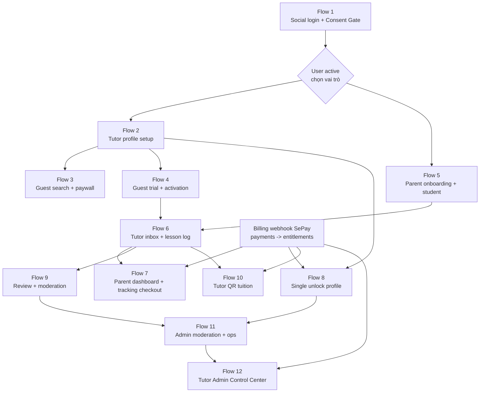

# API cURL User Flow Scenarios

File này mô tả các kịch bản test API theo hành động thật của người dùng trên từng màn hình. Đây là tài liệu đầu vào để dựng mock UI/UX: mỗi màn hình biết cần gọi API nào, input gì, output shape nào, và UI state nào cần hiển thị.

Đối chiếu endpoint: `ai-tasks/05-api-endpoints.md`.

## Mục tiêu tích hợp UI/UX

Các kịch bản trong file này là **contract ráp UI**, không chỉ là ví dụ cURL. Mock UI/UX phải có thể gọi đúng chuỗi API này và chạy thành app được.

Nguyên tắc khi test UI/API:

- Nếu mock UI gọi đúng flow trong file này nhưng API failed, ưu tiên refactor/improve API để đạt business flow, không bắt UI vá bằng logic tạm.
- Nếu business rule thay đổi, cập nhật lại flow cURL, expected output và trạng thái task trong chính file này.
- Nếu một flow chưa chạy được vì thiếu seed/admin role/provider webhook/subscription, ghi rõ ở cột `Status` và `Blocker`.
- Khi flow đã test pass end-to-end, đổi status sang `Verified`.
- Không đánh dấu `Verified` nếu chỉ đọc code hoặc chỉ test từng endpoint lẻ.

## Status tổng quan

| Flow | Màn hình chính | Status | Blocker / ghi chú |
| --- | --- | --- | --- |
| 1 | Social login + Consent Gate | Verified | Google/Facebook là đường register/login chính; phone OTP fallback local pass ngày 2026-07-14 bằng `tutor-api/scripts/verify-flow-01-auth-consent.sh` với mã `272727`; script tự seed legal documents dev |
| 2 | Tutor profile setup | Verified | Pass end-to-end ngày 2026-07-14 bằng `tutor-api/scripts/verify-flow-02-tutor-profile.sh`; đã refactor `POST /tutors/me/payout-accounts` trả đủ safe UI shape |
| 3 | Guest search + paywall | Verified | Pass end-to-end ngày 2026-07-14 bằng `tutor-api/scripts/verify-flow-03-guest-search-paywall.sh`; script tự tạo tutor published qua Flow 2 |
| 4 | Guest trial + activation | Verified | Pass end-to-end ngày 2026-07-14 bằng `tutor-api/scripts/verify-flow-04-guest-trial-activation.sh`; script tự tạo tutor published qua Flow 2 |
| 5 | Parent onboarding + trial | Verified | Pass end-to-end ngày 2026-07-14 bằng `tutor-api/scripts/verify-flow-05-parent-onboarding-trial.sh`; đã refactor `POST /parents/me` trả email để UI reload profile |
| 6 | Tutor inbox + lesson log | Verified | Pass end-to-end ngày 2026-07-14 bằng `tutor-api/scripts/verify-flow-06-tutor-inbox-lesson-log.sh`; script tự tạo parent trial qua Flow 5 |
| 7 | Parent dashboard + tracking checkout | Verified | Pass end-to-end ngày 2026-07-14 bằng `tutor-api/scripts/verify-flow-07-parent-dashboard-tracking.sh`; đã refactor overview trả `latest_lesson`, detail chưa mua trả `PAYMENT_REQUIRED`, billing entitlement có `status` |
| 8 | Single unlock profile | Verified | Pass end-to-end ngày 2026-07-14 bằng `tutor-api/scripts/verify-flow-08-single-unlock-profile.sh`; fixture dev chưa seed media/review nên unlocked detail trả `intro_video_url=null`, `reviews=[]` |
| 9 | Review + moderation | Verified | Pass end-to-end ngày 2026-07-14 bằng `tutor-api/scripts/verify-flow-09-review-moderation.sh`; script tự grant admin role trong DB verify |
| 10 | Tutor QR tuition | Verified | Pass end-to-end ngày 2026-07-14 bằng `tutor-api/scripts/verify-flow-10-tutor-qr-tuition.sh`; script tự checkout + webhook gói `tutor_qr` trước khi tạo QR học phí, giá đọc từ checkout để tương thích `product_pricing` |
| 11 | Admin moderation | Verified | Pass end-to-end ngày 2026-07-14 bằng `tutor-api/scripts/verify-flow-11-admin-moderation-ops.sh`; script dùng Flow 8 để có paid `single_unlock` và tutor pending moderation |
| 12 | Tutor Admin Control Center | Verified | Pass end-to-end ngày 2026-07-14 bằng `tutor-api/scripts/verify-flow-12-tutor-admin-ops.sh`; đã thêm API dashboard/users/logs/platform VietQR/pricing/paid-feature override, checkout đọc pricing/account/override |

## Sơ đồ đối chiếu màn hình và ERD nghiệp vụ

Mục tiêu của phần này là giúp mock UI/UX đối chiếu nhanh: mỗi màn hình trong flow cURL đang đọc/ghi nhóm dữ liệu nào, và ID nào được truyền sang màn tiếp theo. Node `SCREEN_*` là màn hình/nhóm màn hình; node còn lại là entity nghiệp vụ chính.

### Luồng phụ thuộc giữa các màn hình



### ERD rút gọn theo màn hình chức năng

```mermaid
erDiagram
  SCREEN_AUTH {
    string flow "1"
    string screen "Social login + Consent Gate"
  }
  SCREEN_TUTOR_PROFILE {
    string flow "2"
    string screen "Tutor profile setup"
  }
  SCREEN_MARKET {
    string flow "3,4,8"
    string screen "Search, paywall, trial, unlock"
  }
  SCREEN_PARENT {
    string flow "5,7"
    string screen "Parent onboarding, students, dashboard"
  }
  SCREEN_TUTOR_WORK {
    string flow "6,10"
    string screen "Inbox, class, lesson log, tuition QR"
  }
  SCREEN_REVIEW_ADMIN {
    string flow "9,11"
    string screen "Review, moderation, admin ops"
  }
  SCREEN_TUTOR_ADMIN {
    string flow "12"
    string screen "Tutor Admin Control Center"
  }

  USER {
    char id PK
    string phone
    string roles
    string status
  }
  LEGAL_DOCUMENT {
    char id PK
    string doc_type
    string version
  }
  LEGAL_CONSENT {
    char id PK
    char user_id FK
    char terms_document_id FK
    char privacy_document_id FK
  }
  AUTH_ACCOUNT {
    char id PK
    char user_id FK
    string provider
    string provider_user_id
  }
  TUTOR_PROFILE {
    char id PK
    char user_id FK
    string status
    string moderation_status
  }
  TUTOR_AVAILABILITY {
    char id PK
    char tutor_profile_id FK
  }
  TUTOR_PAYOUT_ACCOUNT {
    char id PK
    char tutor_profile_id FK
  }
  PARENT_PROFILE {
    char id PK
    char user_id FK
  }
  STUDENT {
    char id PK
    char parent_profile_id FK
  }
  LEAD {
    char id PK
    string contact_phone
    string status
  }
  ACTIVATION_TOKEN {
    char id PK
    char lead_id FK
    char trial_request_id FK
  }
  TRIAL_REQUEST {
    char id PK
    char parent_profile_id FK
    char lead_id FK
    char student_id FK
    char tutor_profile_id FK
    string status
  }
  CLASS_CONTRACT {
    char id PK
    char trial_request_id FK
    char parent_profile_id FK
    char student_id FK
    char tutor_profile_id FK
    string status
  }
  LESSON_LOG {
    char id PK
    char class_contract_id FK
    char tutor_profile_id FK
  }
  PAYMENT {
    char id PK
    char payer_user_id FK
    string product_type
    string status
    string provider_reference
  }
  SUBSCRIPTION {
    char id PK
    char user_id FK
    string type
    char scope_ref_id
    string status
  }
  PROFILE_UNLOCK {
    char id PK
    char parent_profile_id FK
    char tutor_profile_id FK
    char payment_id FK
  }
  REVIEW {
    char id PK
    char class_contract_id FK
    char tutor_profile_id FK
    string status
  }
  TUTOR_PAYMENT_QR_RECORD {
    char id PK
    char tutor_profile_id FK
    char class_contract_id FK
    char payout_account_id FK
    string collection_status
  }
  AUDIT_LOG {
    char id PK
    char actor_user_id FK
    string action
    string entity_type
  }
  WEBHOOK_EVENT {
    char id PK
    string provider
    string provider_reference
    string process_status
  }
  OUTBOX_EVENT {
    char id PK
    string aggregate_type
    string event_type
    string status
  }
  PLATFORM_PAYMENT_ACCOUNT {
    char id PK
    string bank_code
    string account_number
    boolean is_active
  }
  PRODUCT_PRICING {
    char id PK
    string product_type
    int amount
    boolean is_enabled
  }
  PAID_FEATURE_OVERRIDE {
    char id PK
    char user_id FK
    string feature
    boolean enabled
    datetime expires_at
  }

  SCREEN_AUTH ||--o{ USER : "F1 login"
  SCREEN_AUTH ||--o{ AUTH_ACCOUNT : "F1 social account"
  SCREEN_AUTH ||--o{ LEGAL_CONSENT : "F1 consent"
  SCREEN_TUTOR_PROFILE ||--|| TUTOR_PROFILE : "F2 create/publish"
  SCREEN_TUTOR_PROFILE ||--o{ TUTOR_AVAILABILITY : "F2 availability"
  SCREEN_TUTOR_PROFILE ||--o{ TUTOR_PAYOUT_ACCOUNT : "F2 payout"
  SCREEN_MARKET ||--o{ TUTOR_PROFILE : "F3 search/detail"
  SCREEN_MARKET ||--o{ TRIAL_REQUEST : "F4 guest trial"
  SCREEN_MARKET ||--o{ PROFILE_UNLOCK : "F8 unlock"
  SCREEN_PARENT ||--|| PARENT_PROFILE : "F5 bootstrap"
  SCREEN_PARENT ||--o{ STUDENT : "F5/F7 student"
  SCREEN_PARENT ||--o{ SUBSCRIPTION : "F7 tracking"
  SCREEN_TUTOR_WORK ||--o{ TRIAL_REQUEST : "F6 inbox"
  SCREEN_TUTOR_WORK ||--o{ CLASS_CONTRACT : "F6 class"
  SCREEN_TUTOR_WORK ||--o{ LESSON_LOG : "F6 lesson log"
  SCREEN_TUTOR_WORK ||--o{ TUTOR_PAYMENT_QR_RECORD : "F10 QR"
  SCREEN_REVIEW_ADMIN ||--o{ REVIEW : "F9 review"
  SCREEN_REVIEW_ADMIN ||--o{ AUDIT_LOG : "F11 audit"
  SCREEN_TUTOR_ADMIN ||--o{ USER : "F12 users/stats"
  SCREEN_TUTOR_ADMIN ||--o{ AUDIT_LOG : "F12 audit logs"
  SCREEN_TUTOR_ADMIN ||--o{ WEBHOOK_EVENT : "F12 webhook logs"
  SCREEN_TUTOR_ADMIN ||--o{ OUTBOX_EVENT : "F12 outbox logs"
  SCREEN_TUTOR_ADMIN ||--o{ PLATFORM_PAYMENT_ACCOUNT : "F12 VietQR setup"
  SCREEN_TUTOR_ADMIN ||--o{ PRODUCT_PRICING : "F12 pricing"
  SCREEN_TUTOR_ADMIN ||--o{ PAID_FEATURE_OVERRIDE : "F12 feature override"

  USER ||--o| PARENT_PROFILE : has
  USER ||--o| TUTOR_PROFILE : has
  USER ||--o{ AUTH_ACCOUNT : login_with
  USER ||--o{ LEGAL_CONSENT : accepts
  LEGAL_DOCUMENT ||--o{ LEGAL_CONSENT : versioned_by
  PARENT_PROFILE ||--o{ STUDENT : owns
  TUTOR_PROFILE ||--o{ TUTOR_AVAILABILITY : owns
  TUTOR_PROFILE ||--o{ TUTOR_PAYOUT_ACCOUNT : owns
  TUTOR_PROFILE ||--o{ TRIAL_REQUEST : receives
  PARENT_PROFILE ||--o{ TRIAL_REQUEST : sends
  LEAD ||--o{ TRIAL_REQUEST : guest_sends
  LEAD ||--o{ ACTIVATION_TOKEN : activates
  TRIAL_REQUEST ||--o| CLASS_CONTRACT : accepted_into
  STUDENT ||--o{ CLASS_CONTRACT : attends
  TUTOR_PROFILE ||--o{ CLASS_CONTRACT : teaches
  CLASS_CONTRACT ||--o{ LESSON_LOG : logs
  USER ||--o{ PAYMENT : pays
  PAYMENT ||--o| SUBSCRIPTION : grants
  PAYMENT ||--o| PROFILE_UNLOCK : grants
  USER ||--o{ SUBSCRIPTION : owns
  USER ||--o{ PAID_FEATURE_OVERRIDE : has_override
  PARENT_PROFILE ||--o{ PROFILE_UNLOCK : owns
  TUTOR_PROFILE ||--o{ PROFILE_UNLOCK : unlocked
  CLASS_CONTRACT ||--o| REVIEW : receives
  TUTOR_PROFILE ||--o{ REVIEW : rated_by
  TUTOR_PAYOUT_ACCOUNT ||--o{ TUTOR_PAYMENT_QR_RECORD : funds_to
  CLASS_CONTRACT ||--o{ TUTOR_PAYMENT_QR_RECORD : billed_for
  USER ||--o{ AUDIT_LOG : acts
```



### Bảng map nhanh flow -> entity -> ID truyền tiếp

| Flow | Màn hình | Entity ghi/đọc chính | ID output quan trọng |
| --- | --- | --- | --- |
| 1 | Social login + Consent Gate | `users`, `auth_accounts`, `otp_requests`, `legal_documents`, `legal_consents` | `access_token`, `user.id` |
| 2 | Tutor profile setup | `tutor_profiles`, `tutor_availabilities`, `tutor_payout_accounts` | `TUTOR_PROFILE_ID`, `PAYOUT_ACCOUNT_ID` |
| 3 | Guest search + paywall | `tutor_profiles`, `profile_unlocks`, `subscriptions` | `TUTOR_PROFILE_ID` |
| 4 | Guest trial + activation | `leads`, `trial_requests`, `activation_tokens`, `class_contracts`, `parent_profiles` | `TRIAL_ID`, `CLASS_ID`, `activation_token` |
| 5 | Parent onboarding + trial | `parent_profiles`, `students`, `trial_requests` | `PARENT_TOKEN`, `STUDENT_ID`, `TRIAL_ID` |
| 6 | Tutor inbox + lesson log | `trial_requests`, `class_contracts`, `lesson_logs` | `CLASS_ID`, `LESSON_LOG_ID` |
| 7 | Dashboard + tracking checkout | `students`, `lesson_logs`, `payments`, `subscriptions`, `webhook_events` | `PAYMENT_ID`, `PROVIDER_REFERENCE` |
| 8 | Single unlock profile | `payments`, `profile_unlocks`, `tutor_profiles`, `reviews`, `media_assets` | `PAYMENT_ID`, `PROVIDER_REFERENCE` |
| 9 | Review + moderation | `class_contracts`, `reviews`, `audit_logs` | `REVIEW_ID` |
| 10 | Tutor QR tuition | `subscriptions`, `tutor_payout_accounts`, `tutor_payment_qr_records` | `QR_RECORD_ID` |
| 11 | Admin moderation | `tutor_profiles`, `payments`, `audit_logs` | `TUTOR_PROFILE_ID`, `PAYMENT_ID` |
| 12 | Tutor Admin Control Center | `users`, `audit_logs`, `webhook_events`, `outbox_events`, `platform_payment_accounts`, `product_pricing`, `paid_feature_overrides` | `ADMIN_TARGET_USER_ID`, `PRODUCT_TYPE`, `FEATURE` |

## Quy ước chung

Base URL:

```bash
export ROOT="http://localhost:3000"
export API="$ROOT/api/v1"
```

Header thường dùng:

```bash
export JSON="Content-Type: application/json"
export PARENT_AUTH="Authorization: Bearer $PARENT_TOKEN"
export TUTOR_AUTH="Authorization: Bearer $TUTOR_TOKEN"
export ADMIN_AUTH="Authorization: Bearer $ADMIN_TOKEN"
```

Biến ID lấy từ output bước trước:

```bash
export TUTOR_PROFILE_ID="<tutor_profile_id>"
export STUDENT_ID="<student_id>"
export TRIAL_ID="<trial_request_id>"
export CLASS_ID="<class_contract_id>"
export PAYMENT_ID="<payment_id>"
export PROVIDER_REFERENCE="<provider_reference>"
export PAYOUT_ACCOUNT_ID="<payout_account_id>"
export REVIEW_ID="<review_id>"
export ADMIN_TARGET_USER_ID="<user_id>"
export PRODUCT_TYPE="parent_tracking"
export FEATURE="tutor_qr"
```

Ghi chú:

- Output dưới đây là shape tối thiểu để mock UI, không phải toàn bộ response.
- Với môi trường development/local, `POST /auth/otp/request` trả thêm `dev_code="272727"` để test nhanh. Google/Facebook mới là đường register/login chính; OTP phone chỉ là fallback/local cho tới khi có provider gửi OTP thật.
- Một số kịch bản cần dữ liệu có sẵn: legal documents active, tutor đã published, user có role admin, hoặc subscription active. Nếu chưa có seed, dùng phần này như contract mock.
- Mọi lỗi API chuẩn hóa dạng `{ code, message, details?, request_id? }`.

---

## Kịch bản 1: Màn Social Login + Consent Gate

Mục tiêu UI:

- Người dùng bấm "Tiếp tục với Google" hoặc "Tiếp tục với Facebook".
- Client lấy `id_token`/`access_token` từ SDK chính thức rồi gửi về API; server verify token với provider, không tin thông tin profile client tự gửi.
- Phone OTP vẫn còn cho fallback/local; môi trường local dùng mã cố định `272727`.
- Nếu `consent_required=true`, app chuyển sang màn consent toàn màn hình.
- Sau khi đồng ý, app gọi lại `/auth/me` để quyết định route tiếp theo.

### Step 1A. Login/register bằng Google

User action: bấm "Tiếp tục với Google".

```bash
curl -sS -X POST "$API/auth/oauth/google" \
  -H "$JSON" \
  --data '{
    "id_token": "<google_id_token_from_google_sdk>"
  }'
```

Expected output:

```json
{
  "access_token": "<jwt>",
  "user": {
    "id": "01K...",
    "phone": null,
    "email": "parent@example.com",
    "status": "pending_consent"
  },
  "consent_required": true
}
```

Response còn kèm header `Set-Cookie: kt_refresh=...; HttpOnly; SameSite=Strict; Path=/api/v1/auth` — refresh token KHÔNG nằm trong body. Với cURL, thêm `-c cookies.txt` để lưu cookie.

UI state:

- Chỉ lưu `access_token` trong RAM; refresh token do cookie HttpOnly giữ (giữ đăng nhập qua reload).
- Nếu `consent_required=true`, mở màn consent bắt buộc.

### Step 1B. Login/register bằng Facebook

User action: bấm "Tiếp tục với Facebook".

```bash
curl -sS -X POST "$API/auth/oauth/facebook" \
  -H "$JSON" \
  --data '{
    "access_token": "<facebook_user_access_token_from_facebook_sdk>"
  }'
```

Expected output:

```json
{
  "access_token": "<jwt>",
  "user": {
    "id": "01K...",
    "phone": null,
    "email": "parent@example.com",
    "status": "pending_consent"
  },
  "consent_required": true
}
```

Response còn kèm `Set-Cookie: kt_refresh=...; HttpOnly; SameSite=Strict` — refresh token không nằm trong body (xem Step 1A).

UI state:

- Chỉ lưu `access_token` trong RAM; refresh token do cookie HttpOnly giữ.
- Nếu `consent_required=true`, mở màn consent bắt buộc.

### Step 1C. Fallback/local: Request phone OTP

User action: bấm "Đăng nhập bằng SĐT" hoặc chạy verify local.

```bash
curl -sS -X POST "$API/auth/otp/request" \
  -H "$JSON" \
  --data '{
    "channel": "sms",
    "destination": "0900000000"
  }'
```

Expected output:

```json
{
  "request_id": "01K...",
  "expires_at": "2026-07-14T10:05:00.000Z",
  "dev_code": "272727"
}
```

UI state:

- Hiển thị màn nhập OTP.
- Countdown theo `expires_at`.
- Dev/test có thể auto-fill `dev_code`; non-production luôn là `272727`.

### Step 1D. Fallback/local: Verify OTP

User action: nhập OTP và bấm "Tiếp tục".

```bash
curl -sS -X POST "$API/auth/otp/verify" \
  -H "$JSON" \
  --data '{
    "request_id": "<request_id>",
    "code": "<dev_code>"
  }'
```

Expected output:

```json
{
  "access_token": "<jwt>",
  "refresh_token": "<refresh_token>",
  "user": {
    "id": "01K...",
    "phone": "0900000000",
    "status": "pending_consent"
  },
  "consent_required": true
}
```

UI state:

- Lưu token.
- Nếu `consent_required=true`, mở màn consent bắt buộc.

### Step 3. Load legal documents

User action: màn consent mở, app tải điều khoản/chính sách.

```bash
curl -sS "$API/legal/documents/active"
```

Expected output:

```json
{
  "terms": {
    "id": "01K...",
    "version": "2026-07",
    "content_url": "https://..."
  },
  "privacy": {
    "id": "01K...",
    "version": "2026-07",
    "content_url": "https://..."
  }
}
```

UI state:

- Hiển thị nội dung legal từ `content_url`.
- Chỉ bật nút "Đồng ý" khi user scroll tới cuối.

### Step 4. Record consent

User action: tick đồng ý và bấm "Hoàn tất".

```bash
curl -sS -X POST "$API/legal/consents" \
  -H "$JSON" \
  -H "Authorization: Bearer <access_token>" \
  --data '{
    "terms_document_id": "<terms.id>",
    "privacy_document_id": "<privacy.id>",
    "scroll_reached_bottom": true,
    "consent_method": "scroll_and_click"
  }'
```

Expected output:

```json
{
  "ok": true,
  "user_status": "active"
}
```

### Step 5. Reload session profile

```bash
curl -sS "$API/auth/me" \
  -H "Authorization: Bearer <access_token>"
```

Expected output:

```json
{
  "user": {
    "status": "active"
  },
  "roles": [],
  "profiles": {
    "parent": null,
    "tutor": null
  }
}
```

UI state:

- Nếu chưa có role, hiển thị màn chọn/khởi tạo vai trò.

---

## Kịch bản 2: Tutor App - Màn tạo hồ sơ gia sư

Mục tiêu UI:

- Gia sư nhập thông tin hồ sơ.
- Thêm lịch dạy/lịch rảnh.
- Thêm tài khoản nhận tiền học phí.
- Gửi hồ sơ để xuất hiện trên chợ.

Precondition:

- Có `TUTOR_TOKEN` của user `active`.

### Step 1. Tạo hồ sơ gia sư

User action: bấm "Lưu hồ sơ".

```bash
curl -sS -X POST "$API/tutors/me/profile" \
  -H "$JSON" \
  -H "$TUTOR_AUTH" \
  --data '{
    "display_name": "Co Linh",
    "bio": "Gia su Toan cap 2, uu tien nen tang co ban va thoi quen tu hoc.",
    "region": "Ha Noi",
    "voice_accent": "mien_bac",
    "gender": "female",
    "education_level": "university",
    "school_name": "Dai hoc Su pham Ha Noi",
    "student_year": 3,
    "exam_score": 27.5,
    "gpa": 3.4,
    "expected_fee_min": 180000,
    "expected_fee_max": 250000,
    "subjects": ["math"],
    "grade_levels": [6, 7, 8, 9],
    "teaching_modes": ["online", "offline"],
    "offline_areas": [
      { "province_code": "HN", "district_code": "CG" }
    ]
  }'
```

Expected output:

```json
{
  "id": "01K...",
  "display_name": "Co Linh",
  "status": "draft",
  "moderation_status": "pending",
  "subjects": ["math"],
  "grade_levels": [6, 7, 8, 9],
  "teaching_modes": ["online", "offline"]
}
```

UI state:

- Checklist hồ sơ chuyển các mục đã đủ sang trạng thái complete.
- Lưu `TUTOR_PROFILE_ID`.

### Step 2. Thêm lịch rảnh/bận

User action: thêm slot Thứ 3, 19:00-21:00.

```bash
curl -sS -X POST "$API/tutors/me/availabilities" \
  -H "$JSON" \
  -H "$TUTOR_AUTH" \
  --data '{
    "day_of_week": 2,
    "start_time": "19:00",
    "end_time": "21:00",
    "type": "available",
    "note": "Day online hoac quanh Cau Giay"
  }'
```

Expected output:

```json
{
  "id": "01K..."
}
```

### Step 3. Thêm tài khoản nhận học phí

User action: nhập tài khoản ngân hàng để tạo QR học phí.

```bash
curl -sS -X POST "$API/tutors/me/payout-accounts" \
  -H "$JSON" \
  -H "$TUTOR_AUTH" \
  --data '{
    "bank_code": "970436",
    "account_number": "1234567890",
    "account_holder": "NGUYEN THI LINH",
    "is_default": true
  }'
```

Expected output:

```json
{
  "id": "01K...",
  "bank_code": "970436",
  "account_number_masked": "******7890",
  "account_holder": "NGUYEN THI LINH",
  "is_default": true
}
```

UI state:

- Không bao giờ hiển thị lại số tài khoản đầy đủ.
- Lưu `PAYOUT_ACCOUNT_ID`.

### Step 4. Gửi publish hồ sơ

User action: bấm "Xuất hiện trên chợ".

```bash
curl -sS -X POST "$API/tutors/me/profile/publish" \
  -H "$TUTOR_AUTH"
```

Expected output:

```json
{
  "status": "published"
}
```

UI state:

- Nếu bị `VALIDATION_ERROR`, hiển thị checklist thiếu.
- Nếu published, app chuyển sang màn "Hồ sơ đang hiển thị".

---

## Kịch bản 3: Market - Guest tìm gia sư và xem paywall

Mục tiêu UI:

- Khách mở app thấy ngay danh sách/tìm kiếm.
- Card không lộ video/review chi tiết.
- Trang chi tiết hiển thị paywall nếu chưa unlock.

### Step 1. Search danh sách gia sư

User action: nhập filter Toán lớp 9, online, học phí tối đa 250k.

```bash
curl -sS "$API/tutors/search?subject=math&grade_level=9&teaching_mode=online&fee_max=250000&sort=rating&limit=10"
```

Expected output:

```json
{
  "items": [
    {
      "id": "01K...",
      "display_name": "Co Linh",
      "subjects": ["math"],
      "grade_levels": [6, 7, 8, 9],
      "expected_fee_min": 180000,
      "expected_fee_max": 250000,
      "rating_avg": 4.8,
      "rating_count": 12
    }
  ],
  "next_cursor": null
}
```

UI state:

- Render card preview.
- Lưu `TUTOR_PROFILE_ID` khi user click card.

### Step 2. Xem chi tiết công khai

User action: click card gia sư.

```bash
curl -sS "$API/tutors/$TUTOR_PROFILE_ID/public"
```

Expected output:

```json
{
  "id": "01K...",
  "display_name": "Co Linh",
  "unlock_state": "locked",
  "unlock_via": null,
  "paywall": {
    "products": ["single_unlock", "parent_vip"]
  },
  "intro_video_url": null,
  "reviews": []
}
```

UI state:

- Hiển thị thông tin preview.
- Khóa video/review chi tiết sau paywall.
- CTA: "Mở khóa hồ sơ", "Gửi yêu cầu dạy thử".

---

## Kịch bản 4: Market - Guest gửi yêu cầu dạy thử

Mục tiêu UI:

- Khách chưa đăng nhập vẫn gửi được yêu cầu dạy thử.
- Sau khi gia sư accept, khách nhận activation token/link.

### Step 1. Submit form yêu cầu dạy thử

User action: điền form trên trang chi tiết gia sư.

```bash
curl -sS -X POST "$API/trials" \
  -H "$JSON" \
  --data '{
    "tutor_profile_id": "'"$TUTOR_PROFILE_ID"'",
    "subject": "math",
    "grade": "9",
    "learning_goal": "Lay lai goc dai so va on thi vao 10",
    "teaching_mode": "online",
    "preferred_schedule": "Thu 3, Thu 5 sau 19:00",
    "message": "Muon hoc thu 1 buoi truoc khi chot lich dai han.",
    "contact_name": "Anh Minh",
    "contact_phone": "0912345678",
    "contact_email": "minh@example.com"
  }'
```

Expected output:

```json
{
  "id": "01K...",
  "status": "pending",
  "tutor_profile_id": "01K...",
  "subject": "math",
  "lead_id": "01K..."
}
```

UI state:

- Hiển thị success "Đã gửi yêu cầu".
- Không yêu cầu đăng ký ngay.
- Lưu `TRIAL_ID` nếu test tiếp.

### Step 2. Tutor accept trial từ inbox

User action: gia sư mở inbox yêu cầu và bấm "Chấp nhận".

```bash
curl -sS -X POST "$API/trials/$TRIAL_ID/accept" \
  -H "$TUTOR_AUTH"
```

Expected output:

```json
{
  "trial": {
    "id": "01K...",
    "status": "accepted"
  },
  "class_contract": {
    "id": "01K...",
    "status": "trial_accepted"
  },
  "activation_token": "<raw-token-only-once-for-guest-lead>"
}
```

UI state:

- Tutor thấy class mới ở trạng thái chờ kích hoạt/phụ huynh hoàn tất.
- Hệ thống gửi link kích hoạt cho guest.

### Step 3. Guest hoàn tất activation link

User action: guest mở link trong SMS/email.

```bash
curl -sS -X POST "$API/activation/complete" \
  -H "$JSON" \
  --data '{
    "activation_token": "<activation_token>"
  }'
```

Expected output:

```json
{
  "user": {
    "id": "01K...",
    "phone": "0912345678",
    "status": "pending_consent"
  },
  "parent_profile": {
    "id": "01K..."
  },
  "class_contract": {
    "id": "01K...",
    "status": "trial_accepted"
  },
  "consent_required": true
}
```

UI state:

- Nếu `consent_required=true`, chuyển sang Kịch bản 1 Step 3.
- Sau consent, route vào parent dashboard/lớp.

---

## Kịch bản 5: Parent App - Onboarding, thêm học sinh, gửi trial khi đã đăng nhập

Mục tiêu UI:

- Parent active bootstrap hồ sơ phụ huynh.
- Thêm học sinh/con.
- Gửi trial gắn với `student_id`.
- Xem danh sách trial của mình.

### Step 1. Bootstrap parent profile

```bash
curl -sS -X POST "$API/parents/me" \
  -H "$JSON" \
  -H "$PARENT_AUTH" \
  --data '{
    "display_name": "Anh Minh",
    "email": "minh@example.com"
  }'
```

Expected output:

```json
{
  "id": "01K...",
  "display_name": "Anh Minh",
  "email": "minh@example.com"
}
```

### Step 2. Add student

```bash
curl -sS -X POST "$API/parents/me/students" \
  -H "$JSON" \
  -H "$PARENT_AUTH" \
  --data '{
    "name": "Minh Chau",
    "grade": "9",
    "learning_goals": "On thi vao lop 10 mon Toan"
  }'
```

Expected output:

```json
{
  "id": "01K...",
  "name": "Minh Chau",
  "grade": "9",
  "learning_goals": "On thi vao lop 10 mon Toan"
}
```

UI state:

- Lưu `STUDENT_ID`.

### Step 3. Parent gửi yêu cầu dạy thử

```bash
curl -sS -X POST "$API/trials" \
  -H "$JSON" \
  -H "$PARENT_AUTH" \
  --data '{
    "tutor_profile_id": "'"$TUTOR_PROFILE_ID"'",
    "student_id": "'"$STUDENT_ID"'",
    "subject": "math",
    "grade": "9",
    "learning_goal": "On thi vao lop 10",
    "teaching_mode": "online",
    "preferred_schedule": "Thu 2,4,6 sau 19:30",
    "message": "Can giao vien theo sat bai tap hang tuan."
  }'
```

Expected output:

```json
{
  "id": "01K...",
  "status": "pending",
  "parent_profile_id": "01K...",
  "student_id": "01K..."
}
```

### Step 4. Parent xem trạng thái yêu cầu

```bash
curl -sS "$API/trials/mine?role=parent" \
  -H "$PARENT_AUTH"
```

Expected output:

```json
{
  "items": [
    {
      "id": "01K...",
      "status": "pending",
      "subject": "math",
      "tutor_profile_id": "01K..."
    }
  ]
}
```

UI state:

- Timeline status: pending -> accepted/declined/cancelled.

---

## Kịch bản 6: Tutor App - Inbox trial, tạo lớp, ghi sổ đầu bài

Mục tiêu UI:

- Gia sư xem yêu cầu mới.
- Chấp nhận tạo lớp.
- Chuyển lớp sang active.
- Ghi sổ đầu bài sau buổi học.

### Step 1. Tutor xem inbox yêu cầu

```bash
curl -sS "$API/trials/mine?role=tutor" \
  -H "$TUTOR_AUTH"
```

Expected output:

```json
{
  "items": [
    {
      "id": "01K...",
      "status": "pending",
      "subject": "math",
      "learning_goal": "On thi vao lop 10"
    }
  ]
}
```

### Step 2. Accept trial

```bash
curl -sS -X POST "$API/trials/$TRIAL_ID/accept" \
  -H "$TUTOR_AUTH"
```

Expected output:

```json
{
  "trial": {
    "status": "accepted"
  },
  "class_contract": {
    "id": "01K...",
    "status": "trial_accepted"
  }
}
```

UI state:

- Lưu `CLASS_ID`.
- Hiển thị lớp trong tab "Lớp mới".

### Step 3. Chuyển lớp sang active

```bash
curl -sS -X POST "$API/classes/$CLASS_ID/transition" \
  -H "$JSON" \
  -H "$TUTOR_AUTH" \
  --data '{
    "to": "active"
  }'
```

Expected output:

```json
{
  "id": "01K...",
  "status": "active"
}
```

### Step 4. Tạo sổ đầu bài

User action: sau buổi học, gia sư nhập nhanh nội dung.

```bash
curl -sS -X POST "$API/classes/$CLASS_ID/lesson-logs" \
  -H "$JSON" \
  -H "$TUTOR_AUTH" \
  --data '{
    "lesson_at": "2026-07-14T12:30:00.000Z",
    "subject": "math",
    "content": "On phuong trinh bac nhat va bai tap ap dung.",
    "homework": "Lam bai 1-8 trang 24.",
    "absorption_level": "normal",
    "tutor_note": "Can ren toc do bien doi bieu thuc."
  }'
```

Expected output:

```json
{
  "id": "01K...",
  "class_contract_id": "01K...",
  "subject": "math",
  "absorption_level": "normal",
  "lesson_at": "2026-07-14T12:30:00.000Z"
}
```

UI state:

- Hiển thị log mới trong timeline lớp.
- Lưu `LESSON_LOG_ID` nếu cần edit.

### Step 5. Sửa sổ đầu bài

```bash
curl -sS -X PATCH "$API/lesson-logs/$LESSON_LOG_ID" \
  -H "$JSON" \
  -H "$TUTOR_AUTH" \
  --data '{
    "absorption_level": "good",
    "tutor_note": "Da nam bai sau khi sua loi."
  }'
```

Expected output:

```json
{
  "id": "01K...",
  "absorption_level": "good",
  "tutor_note": "Da nam bai sau khi sua loi."
}
```

---

## Kịch bản 7: Parent Dashboard - Overview, paywall detail, checkout tracking

Mục tiêu UI:

- Parent luôn xem được overview.
- Detail dashboard bị khóa nếu chưa có gói `parent_tracking`.
- Checkout tạo QR VietQR để mở detail.

### Step 1. Xem overview học sinh

```bash
curl -sS "$API/dashboard/students/$STUDENT_ID/overview" \
  -H "$PARENT_AUTH"
```

Expected output:

```json
{
  "student": {
    "id": "01K...",
    "name": "Minh Chau"
  },
  "classes": [
    {
      "id": "01K...",
      "status": "active",
      "subject": "math"
    }
  ],
  "latest_lesson": {
    "subject": "math",
    "absorption_level": "good"
  }
}
```

UI state:

- Hiển thị tổng quan miễn phí.
- CTA "Mở dashboard chi tiết" nếu detail bị khóa.

### Step 2. Thử xem detail khi chưa mua gói

```bash
curl -sS "$API/dashboard/students/$STUDENT_ID/detail" \
  -H "$PARENT_AUTH"
```

Expected locked output:

```json
{
  "code": "PAYMENT_REQUIRED",
  "message": "Cần gói theo dõi học tập"
}
```

UI state:

- Hiển thị paywall gói theo dõi theo từng học sinh.

### Step 3. Checkout gói tracking

```bash
curl -sS -X POST "$API/billing/checkout" \
  -H "$JSON" \
  -H "$PARENT_AUTH" \
  -H "Idempotency-Key: tracking-$STUDENT_ID-202607" \
  --data '{
    "product_type": "parent_tracking",
    "target_ref_id": "'"$STUDENT_ID"'"
  }'
```

Expected output:

```json
{
  "payment_id": "01K...",
  "product_type": "parent_tracking",
  "target_ref_id": "01K...",
  "amount": 69000,
  "status": "pending",
  "vietqr": {
    "qr_url": "https://...",
    "transfer_content": "KTT..."
  },
  "entitlement": {
    "type": "parent_tracking",
    "status": "pending_payment"
  }
}
```

UI state:

- Hiển thị QR và nội dung chuyển khoản.
- Poll `GET /billing/payments/:id`.

### Step 4. Poll trạng thái payment

```bash
curl -sS "$API/billing/payments/$PAYMENT_ID" \
  -H "$PARENT_AUTH"
```

Expected output:

```json
{
  "payment_id": "01K...",
  "status": "pending"
}
```

### Step 5. Giả lập webhook SePay trong môi trường dev

Precondition:

- `SEPAY_WEBHOOK_API_KEY` khớp header.
- IP caller nằm trong allowlist. Với Docker verify thường là service nội bộ hoặc allowlist tắt/rộng trong dev.

```bash
curl -sS -X POST "$API/billing/webhook/sepay" \
  -H "$JSON" \
  -H "x-sepay-api-key: docker-dev-sepay-key" \
  --data '{
    "id": "txn-001",
    "reference": "'"$PROVIDER_REFERENCE"'",
    "amount": 69000,
    "content": "Thanh toan '"$PROVIDER_REFERENCE"'"
  }'
```

Expected output:

```json
{
  "received": true,
  "payment_id": "01K...",
  "status": "paid"
}
```

UI state:

- Khi poll thấy `paid`, đóng QR modal và mở dashboard detail.

---

## Kịch bản 8: Market - Mở khóa hồ sơ gia sư

Mục tiêu UI:

- Parent xem tutor detail locked.
- Checkout `single_unlock`.
- Sau webhook paid, detail trả video/review.

### Step 1. Checkout mở khóa từng hồ sơ

```bash
curl -sS -X POST "$API/billing/checkout" \
  -H "$JSON" \
  -H "$PARENT_AUTH" \
  -H "Idempotency-Key: unlock-$TUTOR_PROFILE_ID" \
  --data '{
    "product_type": "single_unlock",
    "target_ref_id": "'"$TUTOR_PROFILE_ID"'"
  }'
```

Expected output:

```json
{
  "payment_id": "01K...",
  "product_type": "single_unlock",
  "target_ref_id": "01K...",
  "status": "pending",
  "vietqr": {
    "transfer_content": "KTT..."
  }
}
```

### Step 2. Sau khi payment paid, xem lại tutor detail

```bash
curl -sS "$API/tutors/$TUTOR_PROFILE_ID/public" \
  -H "$PARENT_AUTH"
```

Expected output:

```json
{
  "id": "01K...",
  "unlock_state": "unlocked",
  "unlock_via": "single_unlock",
  "bio": "Gia su Toan cap 2...",
  "intro_video_url": "https://signed-url...",
  "reviews": [
    {
      "rating": 5,
      "comment": "Day de hieu"
    }
  ]
}
```

UI state:

- Thay paywall bằng video/review.
- CTA chuyển từ "Mở khóa" sang "Gửi yêu cầu dạy thử".

Ghi chú verify dev:

- Nếu fixture tutor chưa seed media/review approved/published, unlocked detail vẫn phải trả `unlock_state="unlocked"`, `unlock_via="single_unlock"`, `bio` đầy đủ; khi đó `intro_video_url=null` và `reviews=[]` là hợp lệ.

---

## Kịch bản 9: Class Review - Parent đánh giá, tutor report, admin moderate

Mục tiêu UI:

- Sau khi lớp hoàn tất, parent tạo review.
- Tutor có thể report review.
- Admin xử lý publish/hidden.

### Step 1. Chuyển lớp sang chờ review

User action: tutor kết thúc lớp.

```bash
curl -sS -X POST "$API/classes/$CLASS_ID/transition" \
  -H "$JSON" \
  -H "$TUTOR_AUTH" \
  --data '{
    "to": "completed_pending_review"
  }'
```

Expected output:

```json
{
  "id": "01K...",
  "status": "completed_pending_review"
}
```

### Step 2. Parent xem capability review

```bash
curl -sS "$API/classes/$CLASS_ID/review" \
  -H "$PARENT_AUTH"
```

Expected output:

```json
{
  "class_id": "01K...",
  "review": null,
  "can_create": true,
  "can_edit": false,
  "can_report": false
}
```

### Step 3. Parent tạo review

```bash
curl -sS -X POST "$API/classes/$CLASS_ID/review" \
  -H "$JSON" \
  -H "$PARENT_AUTH" \
  --data '{
    "rating": 5,
    "comment": "Co Linh day rat de hieu, con tu tin hon sau 4 buoi."
  }'
```

Expected output:

```json
{
  "id": "01K...",
  "rating": 5,
  "comment": "Co Linh day rat de hieu, con tu tin hon sau 4 buoi.",
  "status": "published",
  "editable_until": "2026-..."
}
```

### Step 4. Tutor report review

```bash
curl -sS -X POST "$API/reviews/$REVIEW_ID/report" \
  -H "$JSON" \
  -H "$TUTOR_AUTH" \
  --data '{
    "reason": "Noi dung co thong tin lien he ngoai nen can admin xem lai."
  }'
```

Expected output:

```json
{
  "status": "disputed"
}
```

### Step 5. Admin moderate review

```bash
curl -sS -X POST "$API/admin/reviews/$REVIEW_ID/moderate" \
  -H "$JSON" \
  -H "$ADMIN_AUTH" \
  --data '{
    "action": "hide"
  }'
```

Expected output:

```json
{
  "id": "01K...",
  "status": "hidden"
}
```

UI state:

- Parent thấy review đã gửi.
- Tutor thấy trạng thái dispute.
- Admin queue giảm item sau khi moderate.

---

## Kịch bản 10: Tutor App - Tạo QR học phí và đánh dấu đã thu

Mục tiêu UI:

- Gia sư có gói `tutor_qr` active.
- Chọn lớp + tài khoản nhận tiền.
- Tạo QR học phí.
- Sau khi tự đối chiếu ngân hàng, đánh dấu đã thu.

Precondition:

- Tutor có `PAYOUT_ACCOUNT_ID`.
- Tutor có subscription `tutor_qr` active.
- Lớp thuộc tutor.

### Step 1. Tạo QR học phí

```bash
curl -sS -X POST "$API/qr/records" \
  -H "$JSON" \
  -H "$TUTOR_AUTH" \
  --data '{
    "class_contract_id": "'"$CLASS_ID"'",
    "amount": 800000,
    "description": "Hoc phi thang 07/2026 - Minh Chau",
    "payout_account_id": "'"$PAYOUT_ACCOUNT_ID"'"
  }'
```

Expected output:

```json
{
  "id": "01K...",
  "amount": 800000,
  "description": "Hoc phi thang 07/2026 - Minh Chau",
  "collection_status": "created",
  "qr_url": "https://...",
  "payment_link": "https://...",
  "transfer_content": "..."
}
```

UI state:

- Hiển thị QR.
- Hiển thị disclaimer: nền tảng không xác nhận dòng tiền học phí.

### Step 2. Danh sách QR

```bash
curl -sS "$API/qr/records?class_contract_id=$CLASS_ID" \
  -H "$TUTOR_AUTH"
```

Expected output:

```json
{
  "items": [
    {
      "id": "01K...",
      "collection_status": "created",
      "amount": 800000
    }
  ]
}
```

### Step 3. Đánh dấu đã thu

```bash
curl -sS -X POST "$API/qr/records/$QR_RECORD_ID/mark-collected" \
  -H "$TUTOR_AUTH"
```

Expected output:

```json
{
  "id": "01K...",
  "collection_status": "marked_collected",
  "marked_collected_at": "2026-07-14T..."
}
```

UI state:

- Chuyển badge sang "Gia sư đã đánh dấu đã thu".
- Không hiển thị như nền tảng đã xác nhận thanh toán.

---

## Kịch bản 11: Admin - Moderation queue và tra cứu vận hành

Mục tiêu UI:

- Admin xem queue kiểm duyệt.
- Duyệt/ẩn tutor, media, review.
- Tra cứu payment/audit log.

### Step 1. Xem moderation queue

```bash
curl -sS "$API/admin/moderation/queue" \
  -H "$ADMIN_AUTH"
```

Expected output:

```json
{
  "tutors": [
    {
      "id": "01K...",
      "display_name": "Co Linh",
      "status": "draft",
      "moderation_status": "pending"
    }
  ],
  "media": [],
  "reviews": []
}
```

### Step 2. Set tutor status

```bash
curl -sS -X POST "$API/admin/tutors/$TUTOR_PROFILE_ID/status" \
  -H "$JSON" \
  -H "$ADMIN_AUTH" \
  --data '{
    "status": "published"
  }'
```

Expected output:

```json
{
  "id": "01K...",
  "status": "published",
  "moderation_status": "approved"
}
```

### Step 3. Tra cứu payment

```bash
curl -sS "$API/admin/payments?status=paid&product_type=single_unlock&limit=20" \
  -H "$ADMIN_AUTH"
```

Expected output:

```json
{
  "items": [
    {
      "id": "01K...",
      "payer_user_id": "01K...",
      "product_type": "single_unlock",
      "amount": 49000,
      "status": "paid"
    }
  ],
  "next_cursor": null
}
```

### Step 4. Xem audit log

```bash
curl -sS "$API/admin/audit-logs?action=admin.tutor_status&entity_type=tutor_profile&entity_id=$TUTOR_PROFILE_ID" \
  -H "$ADMIN_AUTH"
```

Expected output:

```json
{
  "items": [
    {
      "id": "01K...",
      "actor_user_id": "01K...",
      "actor_role": "admin",
      "action": "admin.tutor_status",
      "entity_type": "tutor_profile",
      "entity_id": "01K...",
      "before_hash": "...",
      "after_hash": "..."
    }
  ],
  "next_cursor": null
}
```

UI state:

- Admin UI không hiển thị IP/raw PII.
- Audit detail chỉ hiển thị hash before/after trong giai đoạn này.

---

## Kịch bản 12: Tutor Admin - Control Center nội bộ

Mục tiêu UI:

- Chủ dự án mở app `tutor-admin` để xem thống kê user đăng ký, pending approval và payment summary.
- Xem danh sách user, khóa/mở account.
- Xem logs vận hành.
- Setup tài khoản VietQR nền tảng và phí sản phẩm.
- Bật/tắt chức năng trả phí theo user.
- Dùng lại moderation queue hiện có để phê duyệt tutor/media/review.

Status: **Verified**.

Ghi chú implement:

- Đã implement endpoint mới trong `05-api-endpoints.md` mục `Tutor Admin App / Operations`.
- Đã bổ sung schema/persistence cho `platform_payment_accounts`, `product_pricing`, `paid_feature_overrides`.
- `BillingService` đọc pricing/account active từ DB khi có cấu hình, fallback default/env cho dev.
- `BillingService` và `AccessService` đọc paid-feature override trước khi cho mua/dùng paid feature.
- Script `tutor-api/scripts/verify-flow-12-tutor-admin-ops.sh` đã chạy pass end-to-end ngày 2026-07-14.
- Evidence Flow 12 dùng `ADMIN_TOKEN` được seed/grant trong môi trường verify để kiểm tra operations API. Email/password + refresh-cookie session của `AD-00` được phủ bởi 93 API tests và 15 admin tests ngày 2026-07-16; chưa đổi ngày Verified của script Flow 12 nếu chưa chạy lại toàn chuỗi.

Precondition:

- Có `ADMIN_TOKEN` thuộc user role `admin`.
- Có ít nhất một user target để khóa/mở hoặc toggle feature.

### Step 1. Mở dashboard tổng quan

User action: mở trang đầu app `tutor-admin`.

```bash
curl -sS "$API/admin/overview?from=2026-07-01&to=2026-07-31" \
  -H "$ADMIN_AUTH"
```

Expected output:

```json
{
  "users": {
    "total": 128,
    "active": 120,
    "pending_consent": 4,
    "suspended": 4,
    "by_role": {
      "parent": 72,
      "tutor": 48,
      "admin": 1
    }
  },
  "registrations_by_day": [
    {
      "date": "2026-07-14",
      "count": 9
    }
  ],
  "moderation": {
    "tutors_pending": 3,
    "reviews_pending": 1,
    "media_pending": 0
  },
  "payments": {
    "paid_count": 15,
    "paid_amount": 1270000,
    "pending_count": 2
  }
}
```

UI state:

- Hiển thị dashboard dạng số liệu vận hành, không hiển thị raw PII.

### Step 2. Xem danh sách user

User action: mở tab Users, lọc theo tutor active.

```bash
curl -sS "$API/admin/users?role=tutor&status=active&limit=20" \
  -H "$ADMIN_AUTH"
```

Expected output:

```json
{
  "items": [
    {
      "id": "01K...",
      "email_masked": "li***@example.com",
      "phone_masked": "******1234",
      "roles": ["tutor"],
      "status": "active",
      "created_at": "2026-07-14T...",
      "profiles": {
        "tutor_profile_id": "01K...",
        "tutor_status": "published"
      },
      "paid_features": {
        "tutor_qr": "active"
      }
    }
  ],
  "next_cursor": null
}
```

UI state:

- Bảng user có filter role/status/search.
- Row action gồm xem detail, khóa/mở account, toggle paid feature.

### Step 3. Khóa account user

User action: bấm khóa account và nhập lý do.

```bash
curl -sS -X PATCH "$API/admin/users/$ADMIN_TARGET_USER_ID/status" \
  -H "$JSON" \
  -H "$ADMIN_AUTH" \
  --data '{
    "status": "suspended",
    "reason": "Spam trial requests"
  }'
```

Expected output:

```json
{
  "id": "01K...",
  "status": "suspended",
  "updated_at": "2026-07-14T..."
}
```

UI state:

- User row chuyển badge `suspended`.
- Hiển thị audit trail gần nhất.

### Step 4. Xem logs vận hành

User action: mở tab Logs.

```bash
curl -sS "$API/admin/system-logs?type=audit&entity_type=user&entity_id=$ADMIN_TARGET_USER_ID&limit=20" \
  -H "$ADMIN_AUTH"
```

Expected output:

```json
{
  "items": [
    {
      "id": "01K...",
      "type": "audit",
      "actor_user_id": "01K...",
      "action": "admin.user_status",
      "entity_type": "user",
      "entity_id": "01K...",
      "created_at": "2026-07-14T...",
      "before_hash": "...",
      "after_hash": "..."
    }
  ],
  "next_cursor": null
}
```

UI state:

- Không hiển thị IP, raw webhook payload, secret hoặc PII chưa mask.

### Step 5. Setup tài khoản VietQR nền tảng

User action: mở tab Payment Setup và lưu tài khoản nhận tiền nền tảng.

```bash
curl -sS -X PATCH "$API/admin/platform/payment-account" \
  -H "$JSON" \
  -H "$ADMIN_AUTH" \
  --data '{
    "bank_code": "VCB",
    "account_number": "123456789",
    "account_holder": "KIM THANH TUTOR",
    "is_active": true
  }'
```

Expected output:

```json
{
  "bank_code": "VCB",
  "account_number_masked": "*****6789",
  "account_holder": "KIM THANH TUTOR",
  "is_active": true,
  "updated_at": "2026-07-14T..."
}
```

UI state:

- Không render lại số tài khoản đầy đủ sau khi lưu.
- Checkout mới phải sinh VietQR theo account active mới sau khi API được implement.

### Step 6. Setup phí sản phẩm

User action: chỉnh phí gói theo dõi phụ huynh.

```bash
curl -sS -X PATCH "$API/admin/pricing/$PRODUCT_TYPE" \
  -H "$JSON" \
  -H "$ADMIN_AUTH" \
  --data '{
    "amount": 79000,
    "period_days": 30,
    "is_enabled": true,
    "reason": "Adjust parent tracking launch price"
  }'
```

Expected output:

```json
{
  "product_type": "parent_tracking",
  "amount": 79000,
  "currency": "VND",
  "period_days": 30,
  "is_enabled": true,
  "updated_at": "2026-07-14T..."
}
```

UI state:

- Product disabled thì checkout sản phẩm đó phải hiện lỗi rõ ràng thay vì tạo QR.

### Step 7. Bật/tắt paid feature theo user

User action: tắt quyền dùng QR của một gia sư cụ thể.

```bash
curl -sS -X PATCH "$API/admin/users/$ADMIN_TARGET_USER_ID/paid-features/$FEATURE" \
  -H "$JSON" \
  -H "$ADMIN_AUTH" \
  --data '{
    "enabled": false,
    "reason": "Manual compliance hold",
    "expires_at": "2026-08-14T00:00:00.000Z"
  }'
```

Expected output:

```json
{
  "user_id": "01K...",
  "feature": "tutor_qr",
  "enabled": false,
  "reason": "Manual compliance hold",
  "expires_at": "2026-08-14T00:00:00.000Z",
  "updated_at": "2026-07-14T..."
}
```

UI state:

- User detail hiển thị override này cao hơn quyền do payment/subscription cấp.
- Các API checkout/access-control liên quan phải fail closed khi override đang disable.

### Step 8. Phê duyệt từ admin console

User action: mở tab Approvals.

```bash
curl -sS "$API/admin/moderation/queue" \
  -H "$ADMIN_AUTH"
```

Expected output:

```json
{
  "tutors": [],
  "media": [],
  "reviews": []
}
```

UI state:

- Tab Approvals dùng lại API Flow 11.
- Nếu queue rỗng, hiển thị empty state rõ ràng.

---

## Checklist chuyển sang mock UI/UX

Khi dựng mock UI, mỗi màn cần map rõ:

- API calls khi màn mở.
- API calls khi user bấm CTA chính.
- Loading state cho từng call.
- Empty state khi `items=[]`.
- Error state theo `code`.
- Field nào lưu để bước sau dùng tiếp (`*_ID`, token, cursor).
- Paywall state riêng cho `PAYMENT_REQUIRED`, `UNLOCK_REQUIRED`, `SUBSCRIPTION_EXPIRED`.
- Auth/consent gate riêng cho `AUTH_REQUIRED`, `CONSENT_REQUIRED`.
